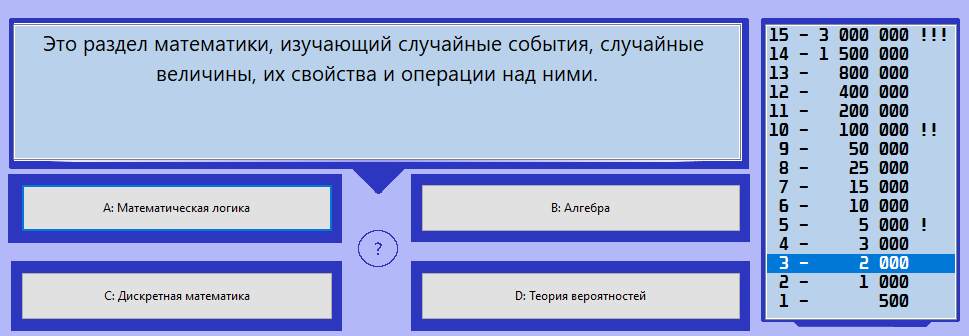

# Who Wants to Be a Mathematician

A Who Wants to Be a Millionaire clone with math-related questions written with Lazarus IDE (Obj-Pascal)

# License
Licensed under GNU General Public License v3.0. See [LICENSE](LICENSE) for more information.